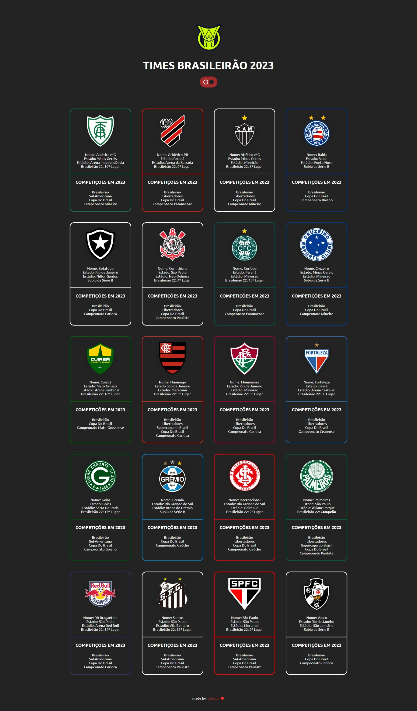

# TIMES BRASILEIRÃO 2023

Site criado para mostrar os times que estarão no campeonato Brasileiro de 2023.


## Layout

<p align="center">
  <a href="https://viniciuswx.github.io/times-brasileirao-2023/">
    
  </a>
</p>


# Diferencial

Possibilidade de alternar o site entre o modo light e dark. Para isso, usei uma pseudo-class chamada :has

- Uso/Exemplo:
```css
:root:has(#light:checked) {
    --bg-color: white;
    --text-color: rgb(35, 35, 35);
    --border-color: rgb(35, 35, 35);
    --line-color: rgb(35, 35, 35);
    --bgteam-color: rgb(35, 35, 35);
    --textteam-color: white;
    --bgld-color: tomato;
}
```

A funcionalidade é ativada quando chamamos o ":checked" do input radio (#light). Quando chamado, ele usara as cores que foi declarada dentro do bloco de códigos.

## Funcionalidades

- Temas dark e light
- Mobile e Desktop


## Habilidades

- HTML
- CSS


## Criador

- [@vinicius](https://www.linkedin.com/in/vinicius-graciano-5081501a1/)

